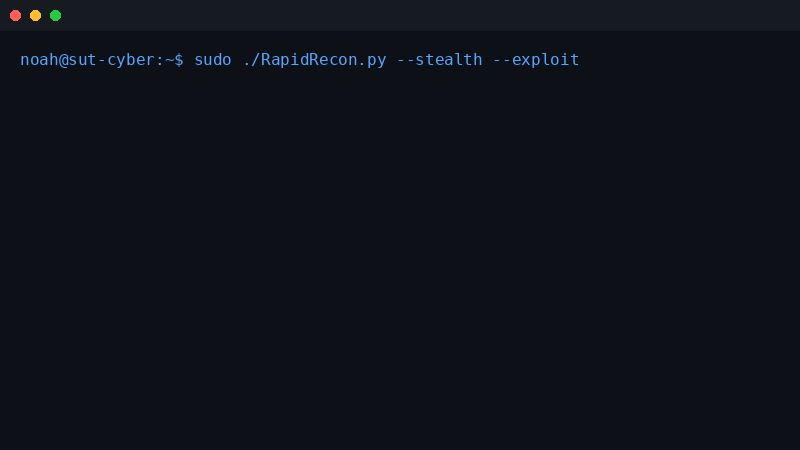

<div align="center">
  
  <h1>RapidRecon Pro</h1>
  <p><strong>Ultra-Forensic Network & Wireless Reconnaissance Arsenal</strong></p>
  
  <p>
    
    
    
    
  </p>
</div>

<br>

<div align="center">
  
</div>

<br>

## ⚡ Overview

**RapidRecon Pro** is an academic-grade, hyper-optimized forensic network scanner and wireless intelligence suite built for modern penetration testing. 

Engineered with an entirely non-blocking asynchronous core, it tears through massive network segments in seconds while simultaneously executing advanced protocol forensics, real-time wireless decloaking, and CVSS-weighted vulnerability assessments.

Developed by **Mohamed Abdelrazek (NOAH)** for advanced cybersecurity operations.

---

## 🔥 Next-Generation Features

### 🚀 Asynchronous Reconnaissance Engine
- **Non-blocking Architecture**: Completely asynchronous I/O sweeps using Python's `asyncio` for zero thread-blocking overhead.
- **5-Method Discovery Sweep**: Automatically correlates hosts using ICMP Ping, ARP Table enumeration, TCP Multi-port scanning, mDNS, and NetBIOS broadcasts.
- **Deep Service Profiling**: Extracts banners, application versions, and HTML `<title>` tags silently.

### 📡 Automated Wireless Intelligence
- **Hidden Network Decloaking**: Automatically intercepts `Dot11ProbeRequest` frames to expose hidden SSIDs (BSSID resolution).
- **Aggressive Deauthentication**: Optional user-confirmed deauthentication attacks (`--deauth`) to force clients to reconnect and expose WPA/WPA2 handshakes.
- **Intelligent Interface Cleanup**: Ensures your Wi-Fi interface is flawlessly restored from `monitor` mode to `managed` mode upon unexpected exits or crashes.
- **Multi-Source Name Resolution**: Resolves client names via DHCP, NetBIOS, mDNS, Apple OUI mapping, and Probe Requests.

### 🛡️ Exploitation & Vulnerability Matrix
- **Automated Exploitation Engine**: Detects anonymous FTP logins, open Redis/MongoDB databases, exposed Docker APIs, and Elasticsearch clusters.
- **CVSS v3.1 Risk Scoring**: Automatically assigns risk levels to open ports based on real-world vulnerabilities (e.g., MS17-010 EternalBlue, BlueKeep, VNC No-Auth).
- **TLS Tagging**: Pulls Common Names (CN) and Subject Alternative Names (SAN) from SSL/TLS certificates.

### 📊 Master Reporting
- **Dynamic Terminal Displays**: Fully dynamic, perfectly aligned Unicode UI tables that scale with your terminal.
- **HTML Dashboards**: Automatically generates beautiful, color-coded HTML forensics dashboards after scanning.

---

## 🛠️ Installation

**RapidRecon** requires Python 3.8+ and relies on `scapy` for its wireless forensic operations.

```bash
# Clone the repository
git clone https://github.com/yourusername/RapidRecon.git
cd RapidRecon

# Install dependencies
pip3 install -r requirements.txt
```

> **Note**: For wireless scanning (`--wireless`), ensure `aircrack-ng` suite (`airmon-ng`, `airodump-ng`) is installed on your Linux system.

---

## 💻 Usage

RapidRecon Pro features a modular and interactive command-line interface.

### Network Reconnaissance & Exploitation

```bash
# Standard 5-method network sweep with stealth jitter
sudo ./RapidRecon.py --target 192.168.1.0/24 --stealth

# Deep inspection of a single target with exploitation engine enabled
sudo ./RapidRecon.py --target 10.10.10.150 --exploit --stealth

# Scan specific ports
sudo ./RapidRecon.py --target 192.168.1.1-254 --ports 21,22,80,443,445
```

### Wireless Intelligence

```bash
# Launch wireless forensic suite (auto-discovers interfaces)
sudo ./RapidRecon.py --wireless

# Enable aggressive deauthentication mode for hidden networks
sudo ./RapidRecon.py --wireless --deauth
```

---

## 🧠 Software Architecture Highlights

* **Reentrant Locking Mechanisms**: Deadlock-free threaded interactions during heavy `Dot11` packet processing.
* **Coroutines over Threads**: Migrated legacy threaded blocking calls to purely asynchronous `asyncio.wait_for` structures.
* **Resilient I/O Streams**: Flawless handling of FTP, SMB, and DNS protocols over pure asynchronous Python sockets without third-party heavy dependencies.

---

## ⚠️ Disclaimer

This tool is strictly for **Authorized Penetration Testing** and **Educational Purposes**. 
The authors and contributors are not responsible for any misuse or damage caused by this software. Never scan, exploit, or deauthenticate networks you do not own or have explicit, documented permission to test.

---
<div align="center">
  <p><i>Developed with passion by <b>Mohamed Abdelrazek (NOAH)</b></i></p>
</div>
